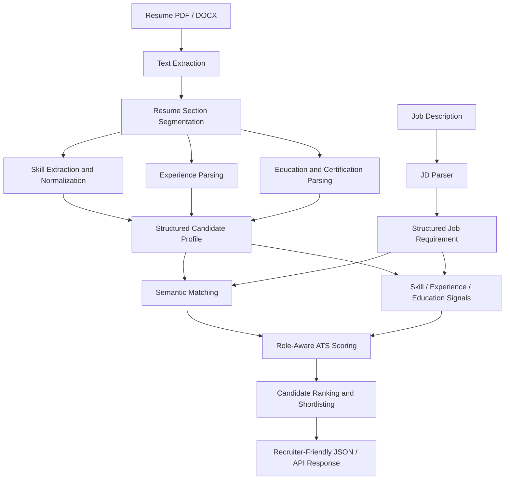
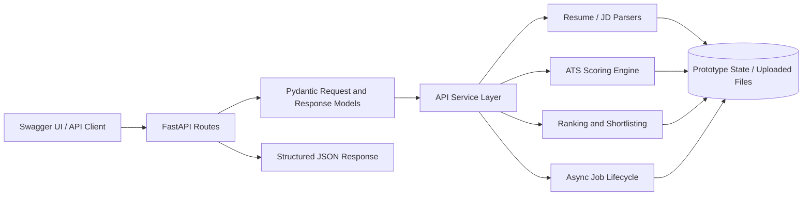

# Zecpath AI System — Applicant Tracking System (ATS)

**Repository:** [Sanjay-Manoj-K/zecpath-ai-system](https://github.com/Sanjay-Manoj-K/zecpath-ai-system)  
**Organization:** Zecser Technology  
**Project:** AI-Based Applicant Tracking System  
**Project scope documented here:** Internship work from Day 1 through Day 20  
**Latest recorded commit:** `8c98ea9` — *Complete Day 20 ATS final review and validation*

> **Project status:** This repository contains a working ATS prototype with resume/JD processing, scoring, ranking, fairness-oriented utilities, API integration and benchmark evidence. It is suitable for supervised demonstration and further development. It has **not** been validated for autonomous real-world hiring: the latest controlled benchmark has only **20% recall**, and production-hardening gaps remain.

---

## Table of Contents

- [1. Project Overview](#1-project-overview)
- [2. Key Capabilities](#2-key-capabilities)
- [3. Architecture](#3-architecture)
- [4. Resume-to-Decision Workflow](#4-resume-to-decision-workflow)
- [5. Internship Progress: Day 1 to Day 20](#5-internship-progress-day-1-to-day-20)
- [6. Technology Stack](#6-technology-stack)
- [7. Repository Layout](#7-repository-layout)
- [8. Run Locally](#8-run-locally)
- [9. API Overview](#9-api-overview)
- [10. ATS Scoring Logic](#10-ats-scoring-logic)
- [11. Benchmark and Validation Results](#11-benchmark-and-validation-results)
- [12. Performance Notes](#12-performance-notes)
- [13. Deliverables and Evidence](#13-deliverables-and-evidence)
- [14. Known Limitations](#14-known-limitations)
- [15. Recommended Next Steps](#15-recommended-next-steps)

---

## 1. Project Overview

Zecpath AI System is an AI-assisted recruitment project focused on the resume screening part of the hiring lifecycle. Its ATS prototype accepts resumes and job descriptions, extracts information into structured candidate/job representations, calculates candidate-to-job relevance signals, combines those signals into an explainable score, and ranks candidates into configurable shortlist, review or reject groups.

The 20-day work progression moved from product and data-model understanding into parsing, skill/experience/education extraction, semantic matching, weighted scoring, ranking, fairness-oriented processing, REST API integration, benchmark testing, performance tuning, documentation and final review.

### Project goals

- Convert PDF and DOCX resumes into usable text and structured profile data.
- Convert job descriptions into structured role requirements.
- Extract and normalize skills, work experience, education and certifications.
- Compare resume and job-description content using deterministic and semantic signals.
- Generate explainable ATS scores and ranked candidate lists.
- Expose key operations through a FastAPI REST API.
- Measure behavior on a controlled multi-role benchmark and preserve limitations transparently.

### Scope boundary

The repository primarily demonstrates the **ATS resume-screening and ranking module**. The full Zecpath product vision also includes areas such as voice screening, HR/technical interviews, machine tests, offer automation and recruiter analytics; those broader product stages should not be assumed to be implemented in this repository just because they appear in the overall product architecture.

---

## 2. Key Capabilities

| Capability | What it does | Main implementation/evidence |
|---|---|---|
| Resume text extraction | Reads PDF and DOCX resume content for downstream parsing. | `parsers/resume_text_extractor.py` |
| Job-description parsing | Extracts role, skills, experience, education and responsibilities into a structured job requirement. | JD parser and `JobRequirement` model |
| Resume section segmentation | Labels blocks such as personal information, summary, work experience, education, skills, certifications and projects. | Day 8 `ResumeSectionClassifier` implementation |
| Skill extraction | Normalizes skill names and aliases, supports skill-stack terms, deduplicates findings and records confidence/evidence. | Day 9 `SkillExtractionEngine` implementation |
| Experience processing | Extracts employment date ranges and role context; provides an experience-relevance signal where usable data is available. | Day 10 experience parsing/relevance components |
| Education and certification parsing | Identifies academic records and certification information for downstream relevance calculations. | Day 11 academic-profile parser |
| Semantic matching | Uses Sentence Transformers embeddings and cosine similarity for resume/JD relevance signals. | `scoring/semantic_matching.py` |
| Weighted ATS scoring | Combines skill match, experience relevance, education alignment and semantic similarity with role-aware weights. | `scoring/ats_scoring_engine.py`, `scoring/day13_candidate_score.py` |
| Candidate ranking | Sorts ATS results and assigns shortlist/review/reject decisions with configurable thresholds. | Day 14 ranking and shortlisting modules |
| Fairness-oriented utilities | Provides resume/score normalization, configurable personal-attribute masking, hybrid skill comparison and group-level audit indicators. | `fairness/` |
| REST API | Exposes health, resume upload, parse, score, shortlisting and asynchronous job endpoints. | `api/main.py`, `api/services.py`, `api/schemas.py` |
| Testing and benchmark | Runs resume/JD combinations across technical and non-technical roles and writes JSON metrics and logs. | `day17/ats_test_runner.py`, `outputs/day17/` |
| Documentation | Stores task-specific reports, API specifications, integration workflow, troubleshooting and readiness notes. | `docs/`, Day-specific reports and this README |

---

## 3. Architecture

The design separates input extraction, profile parsing, scoring and ranking. The API is a thin interface over the internal ATS modules; Pydantic models describe request/response contracts.



### Runtime/API architecture



**Storage note:** uploaded files are written under `data/api_uploads/` during API execution, but resume, score and asynchronous-job state have been documented as **in-memory prototype state**. In-memory state may disappear when the API process restarts; this is a known limitation, not durable production storage.

---

## 4. Resume-to-Decision Workflow

1. **Upload:** A resume is submitted through the API or read from the local resume dataset.
2. **Extract:** PDF/DOCX text extraction creates a text representation for parsing.
3. **Structure:** The section classifier and specialized parsers identify skills, experience, education and certifications.
4. **Normalize:** Skill aliases and text formats are standardized while missing information remains missing rather than being invented.
5. **Parse job requirements:** The JD parser creates a structured role profile with requirements and responsibilities.
6. **Calculate signals:** The system computes skill match, experience relevance, education alignment and semantic similarity where signals are available.
7. **Score:** Role-aware scoring combines available signals and redistributes weights if one or more signals are unavailable.
8. **Rank:** Candidates are sorted and assigned decision zones using configured thresholds.
9. **Return results:** The API or command-line pipeline returns component scores, overall score, candidate order and decision summaries.
10. **Evaluate:** The benchmark compares system decisions with controlled reference labels and reports accuracy, precision, recall and execution errors.

---

## 5. Internship Progress: Day 1 to Day 20

The summary below combines available task sheets, implementation reports, validation outputs and Git evidence. Where an archived task sheet and implementation report have different day labels, the entry describes the implementation evidence and calls out the mismatch instead of inventing a reconciliation.

| Day | Focus | Work and outputs recorded |
|---:|---|---|
| 1 | Product and AI overview | Studied Zecpath's hiring lifecycle and described the responsibilities of AI modules across job posting, resume screening, interviews, decisions and onboarding. Deliverables included a hiring-lifecycle flow and AI responsibilities overview. |
| 2 | AI system architecture | Designed the AI ecosystem as logical services; mapped service inputs/processing/outputs, backend communication, REST APIs/webhooks/queues, synchronous versus asynchronous flows, scalability and model versioning. |
| 3 | Environment and repository setup | Set up the Python development environment, virtual environment, GitHub repository, modular folder organization, logging/testing conventions and README/project structure. |
| 4 | Resume/JD data modeling | Analyzed multiple resume and job-description formats and documented reusable candidate, job, skill and experience entities/schemas to provide a consistent parsing foundation. |
| 5 | Resume text extraction | Implemented PDF and DOCX text extraction, normalization and test runs. The documented implementation uses `pdfplumber` for PDF and `python-docx` for DOCX input. |
| 6 | Job-description parsing | Parsed raw JD text into role, skill, experience, education and responsibility fields and validated the structured object using Pydantic `JobRequirement`. |
| 7 | ATS scoring / candidate-job matching | Implementation reports record deterministic comparison of skills, experience and education, a weighted overall score, matched/missing skill reporting and a readable matching report. **Archive note:** one task-sheet PDF titled Day 7 describes AI data pipeline/storage design, while the Day 7 implementation reports describe ATS scoring; this README follows the implementation reports for the scoring feature. |
| 8 | Resume section segmentation | Implemented a hybrid section classifier using heading aliases, date patterns, content/keyword evidence and context. Reported sections include personal information, summary, experience, education, skills, certifications, projects and other. |
| 9 | Skill extraction | Added canonical skill vocabulary, synonym/spelling normalization, skill-stack expansion, deduplication, evidence-aware confidence and integration into the candidate profile. |
| 10 | Experience parsing and relevance | Built/connected experience extraction and relevance logic based on employment context and date ranges; conservative fallback parsing is used when structured records are unavailable. |
| 11 | Education and certification parsing | Extracted and normalized academic fields and certifications, categorized certification relevance and exposed a structured academic profile for downstream scoring. |
| 12 | Semantic matching | Implemented embedding-based resume/JD comparison using Sentence Transformers (`all-MiniLM-L6-v2`) and cosine similarity. The report records 60 comparison pairs across five job types, threshold evaluation and a matching-accuracy report. |
| 13 | ATS scoring formula design | Built a transparent, role-aware four-signal scoring engine (skill, experience, education and semantic relevance), missing-signal weight redistribution, component-level explanations and a nine-test validation suite. **Validation:** 9/9 passed. |
| 14 | Candidate ranking and shortlisting | Added score sorting, Top-N output and SHORTLIST/REVIEW/REJECT queues. The implementation's configurable defaults are 70% for shortlist and 50% for review; those numeric defaults are engineering choices, not official thresholds from the task sheet. Validation reports record 17/17 ranking checks and 20/20 shortlisting checks passed. |
| 15 | Fairness, normalization and bias indicators | Added resume normalization, hybrid exact-plus-semantic skill matching, score normalization, configurable masking of non-essential attributes and controlled group-level audit indicators. Reported validation: 14/14 normalization, 14/14 keyword reduction, 14/14 score normalization, 22/22 masking and 16/16 bias-indicator checks; integrated pipeline validation also passed 16/16. These indicators are diagnostics, not proof of bias-free outcomes. |
| 16 | ATS REST API integration | Exposed health, upload, parse, score, shortlisting, asynchronous job and job-status routes using FastAPI/Pydantic. Added schemas, API specification, integration-flow documentation and standardized error responses. State persistence remains a prototype limitation. |
| 17 | ATS system testing | Created a controlled multi-role benchmark using 5 job descriptions × 12 resumes = 60 cases across AI/ML Engineer, Data Scientist, Finance Analyst, Legal Intern and Software Engineer roles. An initial run recorded one scoring range error, which was kept as an error rather than assigned an artificial prediction. |
| 18 | Optimization and performance tuning | Benchmarked initialization, extraction, semantic matching and full-pipeline runtime. Reported three-run average full pipeline time was 19.8234 seconds versus a recorded 28.2071-second baseline, approximately 29.7% faster in that test setup. A noisy-resume regression preserved candidate identity and score in the recorded test. |
| 19 | Documentation and knowledge transfer | Prepared/organized technical documentation, architecture/workflow diagrams, scoring descriptions, troubleshooting guidance and a developer-oriented handoff. |
| 20 | Final review and production readiness | Clamped the final semantic similarity score to the expected 0–1 contract, reran the Day 13 validation and 60-case benchmark, checked API routes, created the final evaluation report and live-demo checklist, and committed/pushed the result. Latest recorded commit: `8c98ea9`. |

---

## 6. Technology Stack

| Area | Technology / approach | Purpose |
|---|---|---|
| Language | Python | Parsing, matching, scoring, API services and benchmark scripts |
| Resume input | `pdfplumber`, `python-docx` | Read PDF and DOCX resume text |
| Structured validation | Pydantic | Validate candidate, job and API request/response data |
| API server | FastAPI, Uvicorn | Expose ATS capabilities through REST endpoints and Swagger/OpenAPI |
| Semantic matching | Sentence Transformers, `all-MiniLM-L6-v2`, cosine similarity | Compare semantic relevance between resume and job-description text |
| Scoring utilities | Scikit-learn and custom Python modules | Normalize scores and combine matching signals |
| Output formats | JSON, Markdown | Ranked results, benchmark metrics, reports and developer documentation |
| Version control | Git / GitHub | Source control and delivery evidence |

Dependencies should be installed from the repository's dependency file if one is present. The semantic model may need to be downloaded the first time it is run; Hugging Face Hub unauthenticated warnings were seen during testing but did not prevent the benchmark from completing.

---

## 7. Repository Layout

The following lists the important paths discussed in the implementation reports. Other folders and modules may exist in the repository; this is a guide to the main ATS components rather than a complete filesystem inventory.

```text
zecpath-ai-system/
├── api/
│   ├── main.py                         # FastAPI routes
│   ├── services.py                     # Upload, parse, score, shortlisting and job orchestration
│   ├── schemas.py                      # Pydantic request/response contracts
│   └── day16_schema_validation.py      # API schema validation
├── data/
│   ├── resumes/                        # Resume samples used in tests
│   ├── job_descriptions/               # Job-description samples
│   └── api_uploads/                    # Files uploaded during API execution
├── parsers/
│   ├── resume_text_extractor.py        # PDF/DOCX text extraction
│   └── ...                             # Resume/JD and profile parsers
├── scoring/
│   ├── ats_scoring_engine.py           # Role-aware ATS score aggregation
│   ├── semantic_matching.py            # Semantic similarity and score contract guard
│   ├── day13_candidate_score.py         # Final candidate score generation
│   ├── day14_end_to_end.py              # End-to-end candidate ranking flow
│   ├── resume_ranking_engine.py         # Candidate ranking
│   ├── shortlisting_automation.py       # Decision queues and thresholds
│   └── ...                             # Validation and scoring utilities
├── fairness/                           # Normalization, masking and audit utilities
├── day17/
│   ├── ats_test_runner.py              # 60-case benchmark runner
│   └── manual_review_dataset.py        # Controlled benchmark reference dataset
├── outputs/
│   └── day17/
│       ├── day17_accuracy_metrics.json # Benchmark metrics
│       ├── day17_test_results.json     # Case-level test results
│       └── day20_final_benchmark.log   # Final Day 20 benchmark log
├── docs/
│   ├── day16_ats_api_spec.md            # API reference
│   └── day16_integration_flow.md       # API integration workflow
├── DAY17_ATS_System_Testing_Report.md
├── DAY20_ATS_Final_Evaluation_Report.md
├── DAY20_Live_Demo_Checklist.md
└── README.md
```

---

## 8. Run Locally

These commands are for local development on Windows PowerShell. Run them from the project root.

### 8.1 Create or activate the virtual environment

If the repository's `.venv` already exists:

```powershell
.\.venv\Scripts\Activate.ps1
```

If dependencies have not been installed yet and the project contains `requirements.txt`:

```powershell
python -m pip install --upgrade pip
pip install -r requirements.txt
```

### 8.2 Run scoring validation

```powershell
python -m py_compile .\scoring\semantic_matching.py
python -m scoring.day13_validation
```

**Expected recorded result:** Day 13 validation reports 9 tests passed and 0 failed.

### 8.3 Run the Day 17 benchmark

```powershell
$env:PYTHONIOENCODING = "utf-8"
$env:PYTHONUTF8 = "1"
python -u -m day17.ats_test_runner
```

The runner writes results and metrics under `outputs/day17/`. Model initialization can make the first run slower than subsequent runs.

### 8.4 Start the API

```powershell
python -m uvicorn api.main:app --host 127.0.0.1 --port 8000
```

Open the interactive API documentation at:

- Swagger UI: <http://127.0.0.1:8000/docs>
- Health check: <http://127.0.0.1:8000/health>
- OpenAPI schema: <http://127.0.0.1:8000/openapi.json>

If port 8000 is already occupied, check whether an existing Uvicorn process is running before starting another one. The API's in-memory state is not durable across process restarts; upload and process a resume in the same server session.

---

## 9. API Overview

The API routes documented and exercised through Swagger include the following.

| Method | Endpoint | Purpose | Recorded expected response |
|---|---|---|---|
| `GET` | `/health` | Check that the service is available. | `200 OK` |
| `POST` | `/api/v1/resumes` | Upload a resume file. | `201 Created` with a `resume_id` |
| `POST` | `/api/v1/resumes/{resume_id}/parse` | Parse an uploaded resume into a candidate profile. | `200 OK` |
| `POST` | `/api/v1/resumes/{resume_id}/score` | Score a resume against a job description. | `200 OK` with score components |
| `POST` | `/api/v1/shortlisting` | Rank/classify candidates. | `200 OK` with ranked decisions |
| `POST` | `/api/v1/jobs` | Create an asynchronous ATS job. | Contract documents `202 Accepted`; inspect actual server response during tests |
| `GET` | `/api/v1/jobs/{job_id}` | Retrieve job state, progress, result or error. | `200 OK` when job is found |

### Example asynchronous request

Use the actual resume and job IDs returned/available in the current server session:

```json
{
  "operation": "score_and_rank",
  "job_description_id": "JD-000001",
  "resume_ids": ["RES-000001"]
}
```

The job-status response should be polled until it reaches `COMPLETED` or a terminal error state. In the latest Day 20 evidence, a fresh-server run confirmed upload (`201`), parse (`200`), score (`200`) and shortlisting (`200`). The job-creation request returned `200` in that run, but a final job-status response from that same restarted session was not included in the recorded evidence. The earlier Day 16 integration test documented a completed asynchronous job; retest the status route if you need fresh evidence for the latest code.

---

## 10. ATS Scoring Logic

### 10.1 Four scoring signals

The Day 13 scoring layer combines four signals:

1. **Skill match** — overlap between normalized candidate skills and job requirements.
2. **Experience relevance** — relationship between extracted experience and the role's requirements.
3. **Education alignment** — alignment between available candidate education information and job preferences.
4. **Semantic similarity** — embedding-based relevance between resume/JD content.

Conceptually, the final score is a weighted combination of available signals:

```python
final_score = sum(signal_score * effective_weight
                  for signal_score, effective_weight in available_signals)
```

Role-aware weights are selected for the normalized job family. Missing signals are not automatically fabricated or treated as a guaranteed zero; the implementation redistributes the remaining weights across available signals. The scoring output includes component values, base/effective weights and contributions to make the score easier to inspect.

Examples of role weights shown in the validation output:

| Role profile | Skill | Experience | Education | Semantic |
|---|---:|---:|---:|---:|
| Software engineering | 0.35 | 0.20 | 0.10 | 0.35 |
| Default / unknown role | 0.35 | 0.20 | 0.15 | 0.30 |
| AI/ML | 0.30 | 0.20 | 0.10 | 0.40 |
| Finance | 0.40 | 0.20 | 0.15 | 0.25 |

The exact weights are implementation configuration, not universal hiring standards. Consult `scoring/ats_scoring_engine.py` for the current source of truth.

### 10.2 Decision zones

The current documented default thresholds are:

- **SHORTLIST:** score at or above 70%.
- **REVIEW:** score at or above 50% and below 70%.
- **REJECT:** score below 50%.

These are configurable prototype defaults. They must be evaluated and calibrated for the intended hiring workflow before use in real decisions.

### 10.3 Day 20 semantic-score refinement

The final semantic score is constrained to the range `0.0`–`1.0` before being returned to the ATS scorer. This addressed a benchmark execution failure caused by a similarity value outside the scorer's accepted range.

```python
# Keep the overall semantic score within the ATS scorer's 0-1 range.
return round(
    max(0.0, min(1.0, float(overall))),
    4,
)
```

The fix was compiled, checked using focused boundary tests (negative, normal and maximum values), and followed by a passing Day 13 validation suite.

---

## 11. Benchmark and Validation Results

### 11.1 Final Day 20 benchmark

The final recorded benchmark covers **5 job descriptions × 12 resumes = 60 resume/JD cases**. It includes AI/ML Engineer, Data Scientist, Finance Analyst, Legal Intern and Software Engineer roles. The reference labels are controlled engineering-evaluation labels, not verified real hiring decisions.

| Metric | Final recorded result |
|---|---:|
| Total cases | 60 |
| Valid predictions | 60 |
| Execution errors | 0 |
| True positives (TP) | 1 |
| True negatives (TN) | 55 |
| False positives (FP) | 0 |
| False negatives (FN) | 4 |
| Accuracy | 93.33% |
| Precision | 100.00% |
| Recall | 20.00% |
| Prediction coverage | 100.00% |
| Execution error rate | 0.00% |
| F1 score (derived from precision and recall) | 33.33% |

### 11.2 How to interpret the metrics

- **Accuracy** is the fraction of all cases classified correctly. The dataset is heavily imbalanced, so accuracy alone is not enough.
- **Precision** is the fraction of predicted positive cases that were positive under the controlled labels. With one true positive and no false positives, precision is 100% in this sample.
- **Recall** is the fraction of all reference-positive cases detected. The benchmark has five positive cases; the system detected one and missed four, so recall is 20%.
- **Coverage** indicates how many cases received valid predictions, separate from correctness.

**Interpretation:** 93.33% accuracy must not be presented as proof of high real-world recruitment accuracy. The low recall is material: relevant candidates can be rejected by the configured decision policy. The dataset is small, imbalanced and manually labeled for engineering evaluation, so broader labeled evaluation and human review are required.

### 11.3 Other validation evidence

| Test or component | Recorded result |
|---|---|
| Day 13 scoring validation | 9/9 passed, 0 failed |
| Day 14 ranking validation | 17/17 passed in the implementation report |
| Day 14 shortlisting validation | 20/20 passed in the implementation report |
| Day 15 resume normalization | 14/14 passed |
| Day 15 keyword-dependence reduction | 14/14 passed |
| Day 15 score normalization | 14/14 passed |
| Day 15 personal-attribute masking | 22/22 passed |
| Day 15 bias indicators | 16/16 passed |
| Day 15 integrated fairness pipeline | 16/16 passed |
| Day 16 API contract/schema validation | 10/10 passed in the implementation report |
| Day 20 API health/docs checks | `/health`, `/docs`, `/openapi.json` returned HTTP 200 in the recorded session |
| Day 20 restarted-server resume flow | Upload 201; parse, score and shortlist 200 |

Validation counts refer to the named historical test suites and should not be added together as if they were one unified test count.

---

## 12. Performance Notes

The Day 18 performance report recorded the following local measurements:

| Metric | Original recorded baseline | Day 18 average | Change |
|---|---:|---:|---:|
| Model initialization | 8.4438 s | 6.8044 s | −19.4% |
| Text extraction | 0.0171 s | 0.0201 s | +17.5% (small absolute time) |
| Semantic matching | 0.3297 s | 0.1072 s | −67.5% |
| Full ATS pipeline | 28.2071 s | 19.8234 s | −29.7% |
| Peak traced allocation | 95.71 MB | 95.71 MB | No observed change |

These figures are tied to the recorded development environment and measurement method. They are useful as a comparison baseline, not a production latency service-level objective. Day 20 also observed two pipeline runs of 19.5853 s and 18.8047 s (mean 19.1950 s), but those two runs are not treated as a fully comparable benchmark against the three-run Day 18 baseline.

---

## 13. Deliverables and Evidence

Important tracked evidence includes:

| Artifact | Purpose |
|---|---|
| `DAY17_ATS_System_Testing_Report.md` | Benchmark scope, methods, interpretation and findings |
| `DAY20_ATS_Final_Evaluation_Report.md` | Final review summary, benchmark metrics, limitations and readiness decision |
| `DAY20_Live_Demo_Checklist.md` | Step-by-step checklist for a supervised live walkthrough |
| `day17/ats_test_runner.py` | Runs the multi-role benchmark |
| `day17/manual_review_dataset.py` | Controlled reference-label dataset and supporting test data |
| `outputs/day17/day17_accuracy_metrics.json` | Overall and role-level metrics in JSON |
| `outputs/day17/day17_test_results.json` | Per-case benchmark output |
| `outputs/day17/day20_final_benchmark.log` | Final benchmark console log |
| `scoring/semantic_matching.py` | Semantic matching implementation with score-range guard |

### Git delivery

- **Commit:** `8c98ea9`
- **Commit message:** `Complete Day 20 ATS final review and validation`
- **Branch:** `main`
- **Remote:** `origin/main`
- **Recorded delivery:** the commit was pushed successfully to GitHub; `git status -sb` showed `main` tracking `origin/main` with a clean working tree.

---

## 14. Known Limitations

| Area | Current limitation | Impact / consequence |
|---|---|---|
| Benchmark recall | Recall is 20% (1 TP and 4 FN in five positive cases). | Relevant candidates may be incorrectly rejected; do not automate final hiring decisions. |
| Dataset | Only 60 resume/JD combinations and five reference-positive labels. | Results have limited statistical confidence and should not be presented as production accuracy. |
| Resume extraction | Some documents with tables or unusual formatting are not segmented into clean records. In a recorded parse, multiple job histories were combined into one experience record and title/company/date fields were blank. | Parsing quality can affect downstream scoring; malformed or incomplete profiles should be reviewed. |
| Missing signals | Experience or project fields may be unavailable for some resumes. | The score remains computable when supported signals are present, but interpretation should show which signals were missing. |
| API persistence | Resume, score and job state use in-memory stores in the prototype. | State may be lost on process restart; uploaded files alone do not make job state durable. |
| Background jobs | Async job lifecycle exists, but a production-grade durable worker/queue is not established by current evidence. | Add persistent queueing, retry behavior and restart recovery before production use. |
| Security | Production authentication/authorization and deployment hardening are not established in current evidence. | Protect candidate data and restrict endpoints before any real deployment. |
| Monitoring | Production-grade metrics, alerting, distributed tracing and operational dashboards remain future work. | Failures and performance regressions may be harder to detect at scale. |
| Fairness | Normalization, masking and group-level indicators are implemented as diagnostics. | They do not prove absence of bias or establish legal compliance. |
| Final demo/review | Technical evidence is documented; formal management review was not confirmed in the available record. | Record the meeting and any actions only after they actually occur. |

---

## 15. Recommended Next Steps

1. **Improve recall:** expand and balance the labeled resume/JD benchmark, review false negatives, calibrate thresholds per role and inspect the effect of missing signals.
2. **Improve resume extraction:** test table-heavy, multi-column, scanned and irregular resumes; retain section boundaries and individual job records wherever possible.
3. **Strengthen automated regression tests:** convert executable validations into repeatable test suites and run them in CI for code changes.
4. **Add durable storage and jobs:** persist uploads, parsed profiles, scores and job states; move long-running jobs to a worker/queue with retry and restart handling.
5. **Harden the API:** add authentication/authorization, request limits, validation, safe error responses, data-retention rules and deployment configuration.
6. **Improve observability:** add structured logs, performance tracking, health monitoring and alerts.
7. **Evaluate fairness carefully:** increase the dataset, define appropriate audit groups/labels, and treat metrics as signals for human review rather than a certificate of bias-free operation.
8. **Finish the supervised demo record:** capture the current restarted-server asynchronous job status and record the live demonstration/management feedback when performed.

---

## Responsible-use statement

This ATS is an engineering prototype for candidate-to-job matching, evaluation and recruiter assistance. Scores and decision zones are not objective measures of a person's worth or a substitute for human judgment. Do not use the current benchmark as evidence that the system is ready to make autonomous hiring or rejection decisions. A recruiter should review the original resume, job requirements, missing data and component explanations before acting on any system-generated recommendation.

---

## Acknowledgement

Developed and documented by **Sanjay Manoj K** as part of the Zecpath AI System internship work at **Zecser Technology**.
